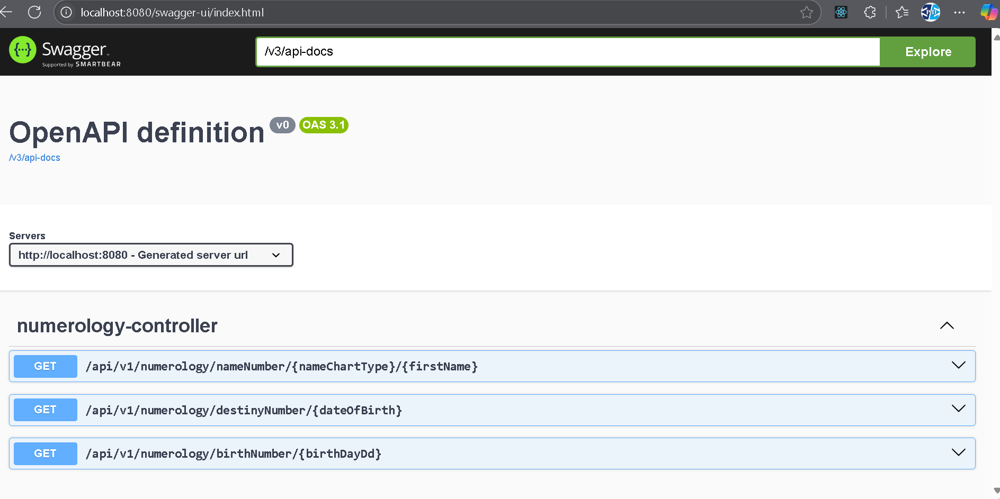

# Numerology APIs

Code base for numerology REST apis.

## Tools and Technology used
- Java
- Spring boot
- Maven
- Docker

## Local Setup
Simply clone the project and run it on your IDE.

## Swagger link
http://localhost:8080/swagger-ui/index.html

